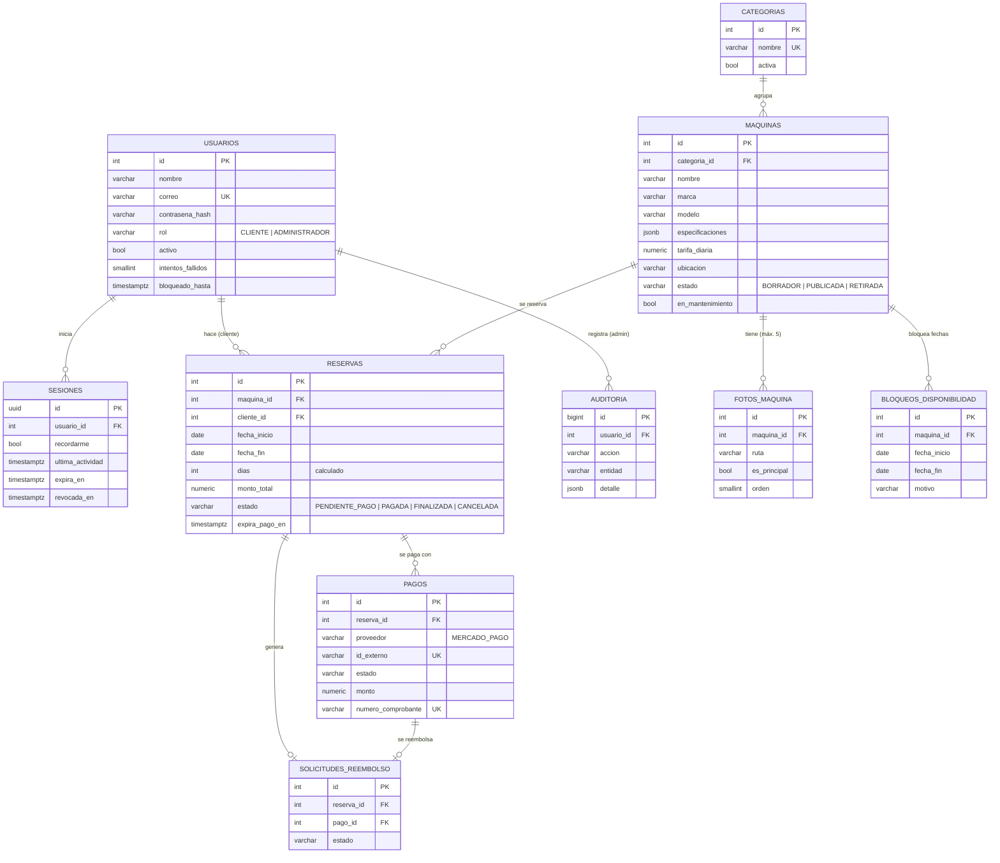
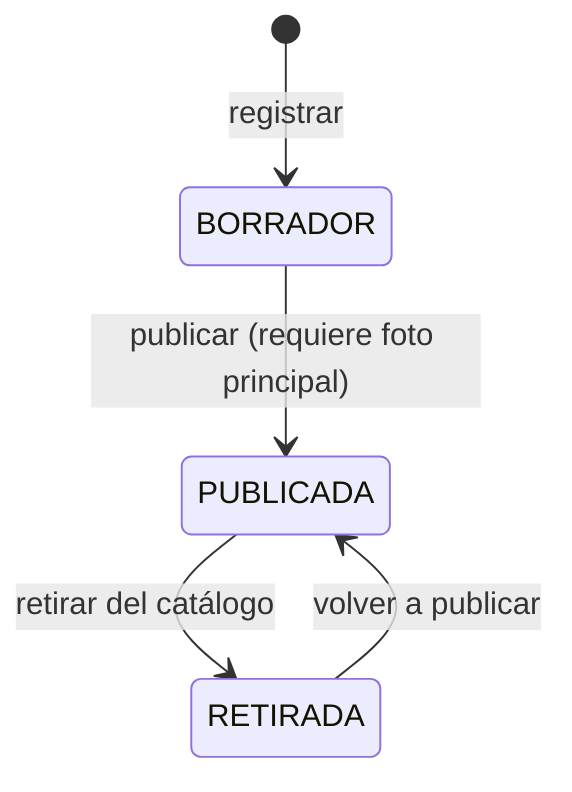

# Base de datos (EN-02)

Motor: **PostgreSQL 14+**. Script: `database/migrations/001_esquema_inicial.sql`.

El modelo ya incluye las tablas de los Sprints 3 y 4 (reservas, pagos, reembolsos, auditoría) para que el diseño quede completo desde el inicio, aunque el código que las usa se construye más adelante.

## Diagrama entidad-relación

## Reglas de negocio que garantiza la propia base de datos

| Regla | Historia | Cómo se garantiza |
|---|---|---|
| El correo no se repite | HU-01 | Índice único `ux_usuarios_correo` (los correos se guardan en minúsculas) |
| La contraseña se guarda cifrada | HU-01 | Solo existe la columna `contrasena_hash` (bcrypt) |
| Nombre de categoría único | HU-14 | Índice único sobre `lower(trim(nombre))` |
| Cada máquina tiene exactamente una categoría | HU-14 | `categoria_id NOT NULL` + FK con `ON DELETE RESTRICT` |
| Máximo 5 fotos por máquina | HU-08 | Trigger `tg_fotos_max` |
| Solo una foto principal | HU-08 | Índice único parcial `ux_fotos_una_principal` |
| Bloqueos sin superponerse | HU-09 | Restricción de exclusión GiST con `daterange` |
| Dos reservas vigentes no ocupan las mismas fechas | HU-05 | Restricción de exclusión sobre reservas `PENDIENTE_PAGO` o `PAGADA` |
| Reserva mínima de 1 día | HU-05 | `CHECK (fecha_fin >= fecha_inicio)`; las fechas son inclusivas |
| Un webhook duplicado no confirma dos veces | HU-06 | Índice único `(proveedor, id_externo)` en pagos |
| Retirar una máquina no borra su historial | HU-08 | Reservas usan `ON DELETE RESTRICT`; retirar = cambiar `estado` |

## Estados de una máquina

`en_mantenimiento` es independiente del estado: una máquina publicada en mantenimiento sigue en el catálogo con un aviso, pero en su detalle se muestra el aviso en lugar de la ficha (HU-04).
