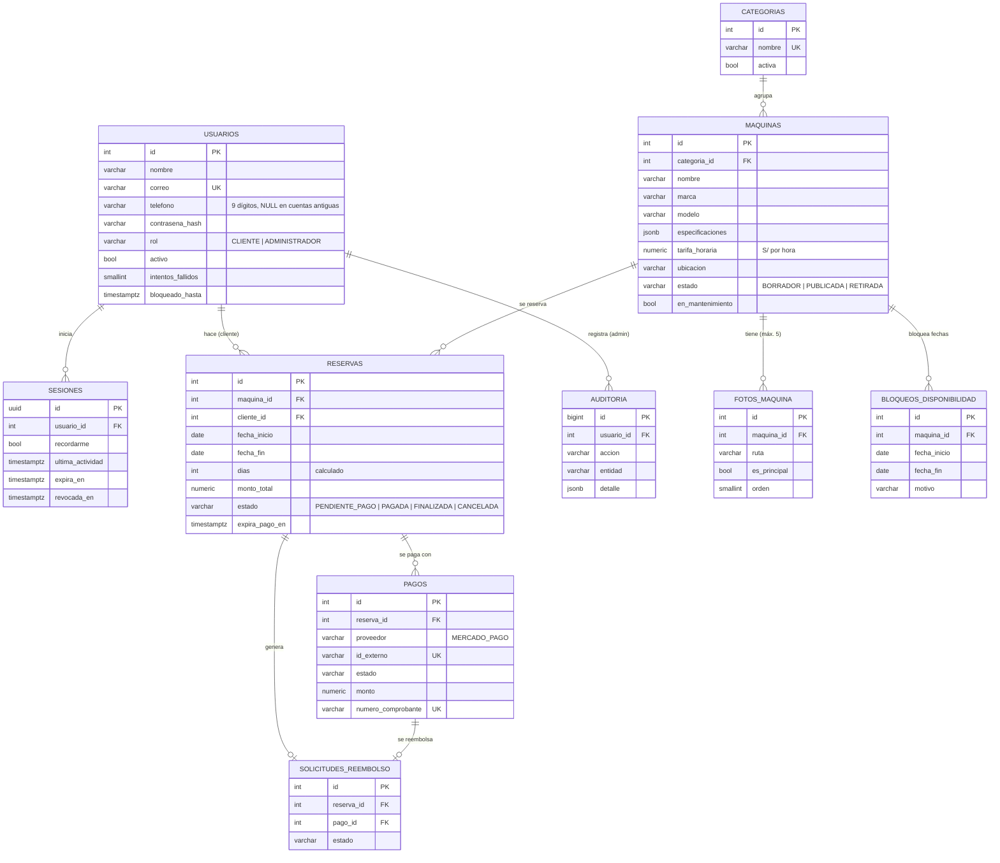
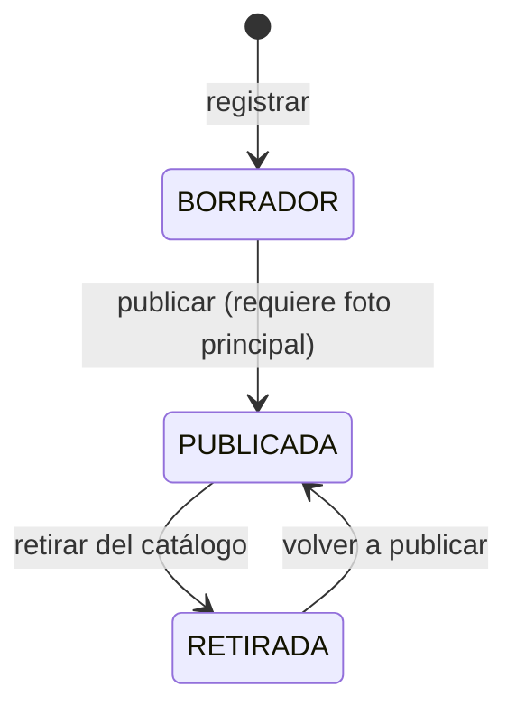

# Base de datos (EN-02)

Motor: **PostgreSQL 14+**. Scripts en `database/migrations/` (se aplican en orden y cada uno una sola vez):

| Migración | Qué hace |
|---|---|
| `001_esquema_inicial.sql` | Crea todas las tablas |
| `002_preparar_rol_proveedor.sql` | (Histórica) reservaba un rol PROVEEDOR; la 004 lo deshace |
| `003_tarifa_y_fechas_por_hora.sql` | La tarifa pasa a ser por hora (`tarifa_horaria`) y las fechas de bloqueos/reservas pasan a `TIMESTAMPTZ` |
| `004_quitar_rol_proveedor.sql` | Elimina el rol PROVEEDOR: solo existen CLIENTE y ADMINISTRADOR |
| `005_telefono_usuario.sql` | Agrega `usuarios.telefono` (celular de 9 dígitos, opcional en la BD para las cuentas antiguas) |

El modelo ya incluye las tablas de los Sprints 3 y 4 (reservas, pagos, reembolsos, auditoría) para que el diseño quede completo desde el inicio, aunque el código que las usa se construye más adelante.

## Diagrama entidad-relación

```mermaid
erDiagram
    USUARIOS ||--o{ SESIONES : "inicia"
    USUARIOS ||--o{ RESERVAS : "hace (cliente)"
    USUARIOS ||--o{ AUDITORIA : "registra (admin)"
    CATEGORIAS ||--o{ MAQUINAS : "agrupa"
    MAQUINAS ||--o{ FOTOS_MAQUINA : "tiene (máx. 5)"
    MAQUINAS ||--o{ BLOQUEOS_DISPONIBILIDAD : "bloquea fechas"
    MAQUINAS ||--o{ RESERVAS : "se reserva"
    RESERVAS ||--o{ PAGOS : "se paga con"
    RESERVAS ||--o| SOLICITUDES_REEMBOLSO : "genera"
    PAGOS ||--o| SOLICITUDES_REEMBOLSO : "se reembolsa"

    USUARIOS {
        int id PK
        varchar nombre
        varchar correo UK
        varchar telefono "9 dígitos, NULL en cuentas antiguas"
        varchar contrasena_hash
        varchar rol "CLIENTE | ADMINISTRADOR"
        bool activo
        smallint intentos_fallidos
        timestamptz bloqueado_hasta
    }
    SESIONES {
        uuid id PK
        int usuario_id FK
        bool recordarme
        timestamptz ultima_actividad
        timestamptz expira_en
        timestamptz revocada_en
    }
    CATEGORIAS {
        int id PK
        varchar nombre UK
        bool activa
    }
    MAQUINAS {
        int id PK
        int categoria_id FK
        varchar nombre
        varchar marca
        varchar modelo
        jsonb especificaciones
        numeric tarifa_horaria "S/ por hora"
        varchar ubicacion
        varchar estado "BORRADOR | PUBLICADA | RETIRADA"
        bool en_mantenimiento
    }
    FOTOS_MAQUINA {
        int id PK
        int maquina_id FK
        varchar ruta
        bool es_principal
        smallint orden
    }
    BLOQUEOS_DISPONIBILIDAD {
        int id PK
        int maquina_id FK
        date fecha_inicio
        date fecha_fin
        varchar motivo
    }
    RESERVAS {
        int id PK
        int maquina_id FK
        int cliente_id FK
        date fecha_inicio
        date fecha_fin
        int dias "calculado"
        numeric monto_total
        varchar estado "PENDIENTE_PAGO | PAGADA | FINALIZADA | CANCELADA"
        timestamptz expira_pago_en
    }
    PAGOS {
        int id PK
        int reserva_id FK
        varchar proveedor "MERCADO_PAGO"
        varchar id_externo UK
        varchar estado
        numeric monto
        varchar numero_comprobante UK
    }
    SOLICITUDES_REEMBOLSO {
        int id PK
        int reserva_id FK
        int pago_id FK
        varchar estado
    }
    AUDITORIA {
        bigint id PK
        int usuario_id FK
        varchar accion
        varchar entidad
        jsonb detalle
    }
```

## Reglas de negocio que garantiza la propia base de datos

| Regla | Historia | Cómo se garantiza |
|---|---|---|
| Solo existen los roles CLIENTE y ADMINISTRADOR | EN-05 | `CHECK (rol IN ('CLIENTE','ADMINISTRADOR'))` (`usuarios_rol_check`). Las máquinas son del negocio: no hay proveedores |
| El celular es de 9 dígitos y empieza con 9 | HU-02 | `ck_usuarios_telefono`: `telefono IS NULL OR telefono ~ '^9[0-9]{8}$'`. Se guarda sin espacios ni `+51`. Es obligatorio al registrarse (lo exige el backend), pero admite `NULL` para no romper las cuentas creadas antes |
| El correo no se repite | HU-01 | Índice único `ux_usuarios_correo` (los correos se guardan en minúsculas) |
| La contraseña se guarda cifrada | HU-01 | Solo existe la columna `contrasena_hash` (PBKDF2-SHA256 con sal) |
| Nombre de categoría único | HU-14 | Índice único sobre `lower(trim(nombre))` |
| Cada máquina tiene exactamente una categoría | HU-14 | `categoria_id NOT NULL` + FK con `ON DELETE RESTRICT` |
| Máximo 5 fotos por máquina | HU-08 | Trigger `tg_fotos_max` |
| Solo una foto principal | HU-08 | Índice único parcial `ux_fotos_una_principal` |
| Bloqueos sin superponerse | HU-09 | Restricción de exclusión GiST con `daterange` |
| Dos reservas vigentes no ocupan las mismas fechas | HU-05 | Restricción de exclusión sobre reservas `PENDIENTE_PAGO` o `PAGADA` |
| Reserva mínima de 1 día | HU-05 | `CHECK (fecha_fin >= fecha_inicio)`; las fechas son inclusivas |
| Un webhook duplicado no confirma dos veces | HU-06 | Índice único `(proveedor, id_externo)` en pagos |
| Retirar una máquina no borra su historial | HU-08 | Reservas usan `ON DELETE RESTRICT`; retirar = cambiar `estado` |

## Filtros del catálogo (HU-03, HU-06)

El catálogo filtra directamente en SQL (no en memoria), sobre la misma condición `WHERE` para la página y para el `count(*)` del total, así la paginación siempre coincide con los filtros:

| Filtro | Condición |
|---|---|
| Categoría | `m.categoria_id = ?` |
| Palabra clave | `lower(m.nombre) LIKE ? OR lower(m.marca) LIKE ?` |
| Precio mínimo (HU-06) | `m.tarifa_horaria >= ?` |
| Precio máximo (HU-06) | `m.tarifa_horaria <= ?` |

## Estados de una máquina

```mermaid
stateDiagram-v2
    [*] --> BORRADOR : registrar
    BORRADOR --> PUBLICADA : publicar (requiere foto principal)
    PUBLICADA --> RETIRADA : retirar del catálogo
    RETIRADA --> PUBLICADA : volver a publicar
```

`en_mantenimiento` es independiente del estado: una máquina publicada en mantenimiento sigue en el catálogo con un aviso, pero en su detalle se muestra el aviso en lugar de la ficha (HU-04).
